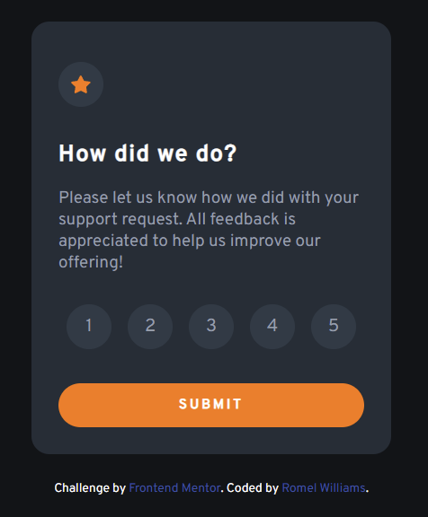
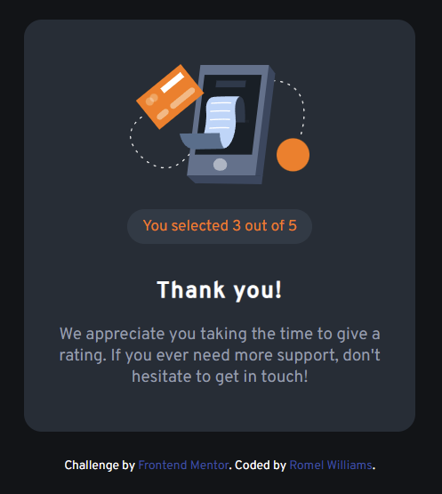

# Frontend Mentor - Interactive rating component solution

This is a solution to the [Interactive rating component challenge on Frontend Mentor](https://www.frontendmentor.io/challenges/interactive-rating-component-koxpeBUmI). Frontend Mentor challenges help you improve your coding skills by building realistic projects.

## Table of contents

- [Overview](#overview)
  - [The challenge](#the-challenge)
  - [Screenshot](#screenshot)
  - [Links](#links)
- [My process](#my-process)
  - [Built with](#built-with)
  - [What I learned](#what-i-learned)
  - [Useful resources](#useful-resources)
- [Author](#author)
- [Acknowledgments](#acknowledgments)

## Overview

### The challenge

Users should be able to:

- View the optimal layout for the app depending on their device's screen size
- See hover states for all interactive elements on the page
- Select and submit a number rating
- See the "Thank you" card state after submitting a rating

### Screenshots




### Links

- Solution URL: [https://github.com/omerome83/Interactive-Rating-Component](https://github.com/omerome83/Interactive-Rating-Component)
- Live Site URL: [https://omerome83.github.io/Interactive-Rating-Component](https://omerome83.github.io/Interactive-Rating-Component)

## My process

### Built with

- Semantic HTML5 markup
- CSS custom properties
- Flexbox
- CSS Grid

### What I learned

This was a nice challenging project. One of which I hope to tackle again in the future and make some adjustments. Especially the responsive portion. The design of laying out the ratings buttons was figuring out how. I first used unordered lists, but then realized I had to figure out to have a button actually select when "clicked". Then it made more sense to use radio buttons. The second biggest challenge was figuring out which of the buttons was selected.

```js
const selectedButton = document.querySelector("input[name='rating']:checked");
selectedRating.innerHTML = `You selected ${selectedButton.id} out of ${radioButtons.length}`;
```

This snippet shows which one of the rating buttons is checked and then I could use that value for a span element from the HTML document.

### Useful resources

- [Stackoverflow](https://stackoverflow.com/questions/45121155/getting-the-value-of-a-checked-radio-button-using-javascript) - This source gave me exactly what I was looking for in determine which of the radio buttons is checked.

## Author

- Website - [Romel Williams](https://github.com/omerome83)
- Frontend Mentor - [@omerome83](https://www.frontendmentor.io/profile/omerome83)
